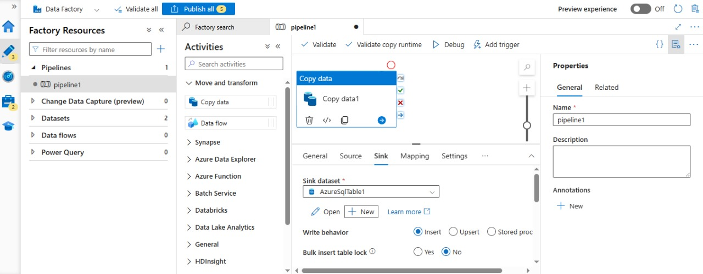
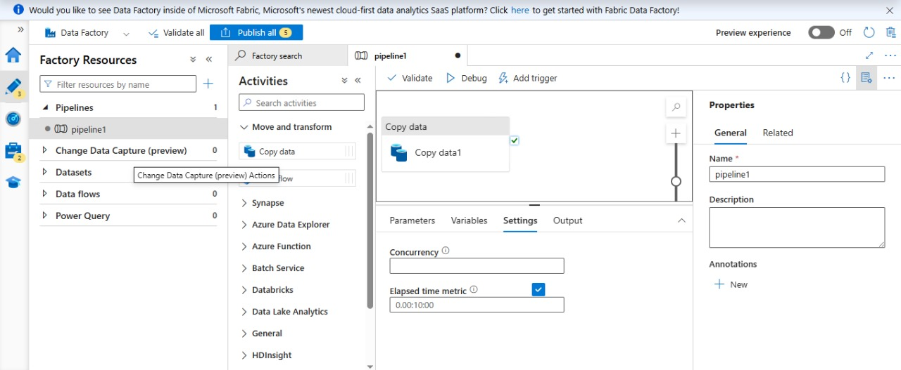

# Configure FTP/ SFTP server and create a ADF pipeline for data extraction

## Create an SFTP linked service using UI

1. Browse to the Manage tab in your Azure Data Factory or Synapse workspace and select Linked Services, then click New:

2. Search for SFTP and select the SFTP connector.

3. Configure the service details, test the connection, and create the new linked service.

 

 